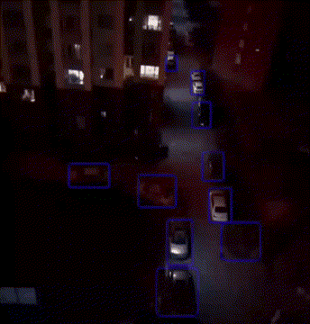

# 基于安卓手机视角的航拍图像实时目标检测
## 开发环境
1、Windows10  
2、pytorch 1.8  + tensorflow 2.x  
3、python 3.8  
4、Android Studio  
5、Android System  
6、YOLOv5 https://github.com/ultralytics/yolov5
## 数据集(Visdrone)
**(1)数据集 https://github.com/VisDrone/VisDrone-Dataset**       

## 1.训练
```
训练方法与YOLOv5相同。
若需训练指定类别，可以通过 visdrone2yolov5.py来修改训练类别。这里整合了所有的汽车类，统一为car，其他类别不参与训练。
python train.py （训练参数同YOLOv5）
```     
## 2.生成.tflite模型
```
python export.py --weights 训练模型路径.pt --cfg models/yolov5s.yaml --img 640（必须等于DetectorFactory.java里的inputSize）  
```
## 3.模型移植到安卓手机上（需要Android Studio）
```
1.将.tflite模型 放在./android/app/src/main/assets里，visdrone.txt修改类别，顺序与训练时的保持一致。
2.打开./android/app/src/main/java/org/tensorflow/lite/examples/detection/tflite/DetectorFactory.java
修改.tflite模型的名字。如果修改了inputSize参数，则还需修改output_width，保持倍数变化。
3.使用Android Studio移植模型，需要打开手机的开发者模式。
```   
## 4.效果



## Reference
1、https://github.com/zldrobit/yolov5  
2、https://github.com/ultralytics/yolov5
       

